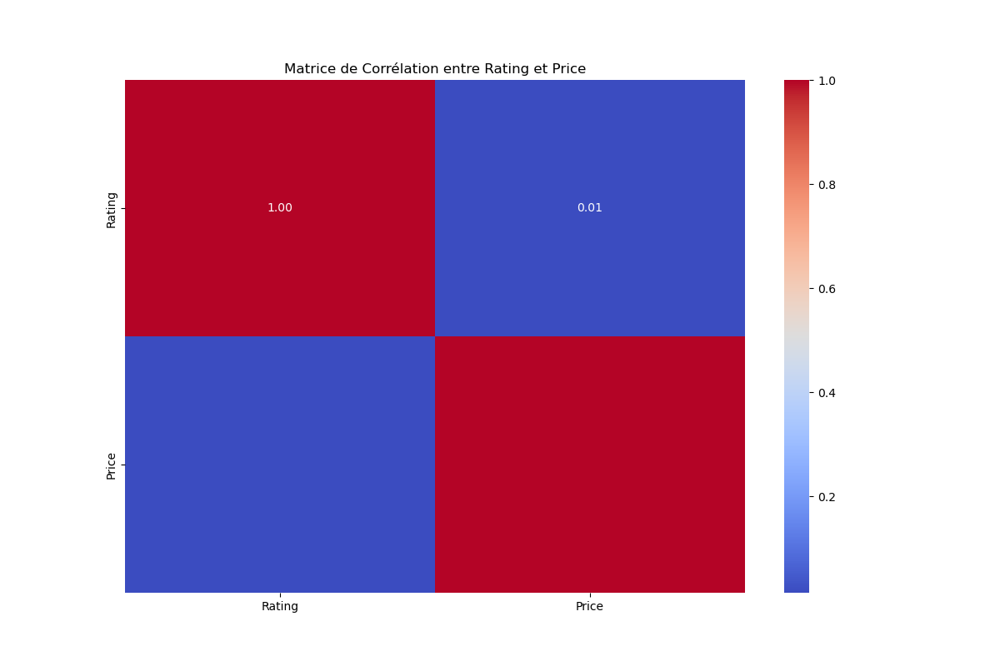

# Rapport Final : Analyse des Meilleures Ventes de Livres sur Amazon

# Adresse du projet sur Github
 https://github.com/Kaled89/Amazon-Bestselling-Books.git

## Introduction

Ce rapport présente les résultats finaux de notre projet d'analyse des meilleures ventes de livres sur Amazon. Nous avons utilisé un modèle de régression linéaire pour prédire les caractéristiques des livres à succès.

## Collecte et Prétraitement des Données

### 1.1 Collecte des Données

Les données utilisées dans ce projet proviennent de Kaggle et incluent des informations sur les ventes de livres sur Amazon. Les colonnes comprennent le titre, l'auteur, la note (Rating) et le prix.

**Variable d'intérêt (cible) :**

- **Nombre de ventes :** Nous cherchons à prédire le nombre de ventes d'un livre, bien que cette information ne soit pas directement disponible dans notre jeu de données. Nous allons utiliser des proxies comme la note moyenne et le nombre de critiques pour estimer la popularité et les ventes.

**Variables explicatives :**

- **Titre du livre (Book Name) :** Le titre du livre peut donner des indications sur son contenu et attirer l'attention des lecteurs.
- **Nom de l'auteur (Author Name) :** Les auteurs célèbres ou populaires ont tendance à vendre plus de livres.
- **Note (Rating) :** La note moyenne des critiques peut influencer les ventes, car les lecteurs se fient souvent aux avis des autres pour faire leurs choix.
- **Prix (Price) :** Le prix du livre est un facteur crucial, car il peut influencer la décision d'achat des consommateurs.

### 1.2 Prétraitement des Données

Nous avons effectué les étapes suivantes pour préparer les données :

- **Nettoyage des Données :** Suppression des doublons et gestion des valeurs manquantes.
- **Encodage des Variables Catégorielles :** Transformation des auteurs et des titres en variables numériques via le one-hot encoding.
- **Normalisation des Données Numériques :** Mise à l'échelle des variables comme le prix et le nombre de critiques pour assurer une distribution uniforme et faciliter la modélisation.

### Exploration des Données

Avant le prétraitement des données, nous avons exploré la distribution des notes, des prix et analysé les auteurs les plus populaires.

#### Figure Distribution des Notes

La distribution des notes montre que la majorité des livres ont une note moyenne élevée, principalement entre 4.4 et 4.6 étoiles. Cela indique que les best-sellers sur Amazon sont généralement bien évalués par les lecteurs. La courbe KDE (Kernel Density Estimate) superposée montre une concentration notable des livres avec des notes élevées, ce qui suggère que les lecteurs préfèrent et favorisent les livres de haute qualité.

#### Figure Distribution des Prix

La distribution des prix des livres révèle une grande variation des prix, avec une concentration notable dans la fourchette de 100 à 400 unités de prix. La courbe KDE (Kernel Density Estimate) superposée montre une diminution progressive des ventes à mesure que les prix augmentent, avec quelques pics dans les gammes de prix plus élevées. Cela peut suggérer que la majorité des consommateurs préfèrent acheter des livres à des prix abordables, mais il existe encore une demande pour des livres plus chers.

#### Figure Auteurs les Plus Populaires

Le graphique des auteurs les plus populaires montre que certains auteurs, comme Wonder House Books et Maple Press, dominent le marché des best-sellers. Wonder House Books, en particulier, a une présence significative avec un nombre élevé de livres best-sellers. Cela pourrait indiquer que ces auteurs ou maisons d'édition ont une stratégie efficace pour publier des livres populaires et répondent bien aux attentes des lecteurs.

#### Figure Matrice de Corrélation

La matrice de corrélation montre les relations suivantes :

- **Rating et Price :** Une corrélation très faible (0.01), ce qui indique qu'il n'y a pas de relation significative entre la note moyenne et le prix. Cela signifie que, dans ce jeu de données, les prix des livres ne semblent pas influencer les notes données par les utilisateurs, ni l'inverse. Cette absence de corrélation peut être due à divers facteurs non liés au prix qui influencent les évaluations des utilisateurs, comme la qualité du contenu, la popularité de l'auteur, le marketing et les attentes des lecteurs.

### Données Après Prétraitement

Après l'exploration initiale, nous avons procédé à la transformation des données pour la modélisation. Voici un aperçu des données après prétraitement :

## Modélisation

### Modèle de Régression Linéaire

Nous avons construit un modèle de régression linéaire pour prédire le nombre de ventes en fonction des caractéristiques des livres (prix, note, auteur, etc.).

#### Figure Résultats de la Régression Linéaire

Les résultats du modèle de régression linéaire montrent que :

1. **Précision élevée :** Avec un R² Score de 0.9711, le modèle explique 97.1% de la variance des données, ce qui indique une très bonne adéquation entre les prédictions et les valeurs réelles.
2. **Erreur faible :** Le Mean Squared Error (MSE) de 0.0223 est faible, ce qui signifie que les prédictions du modèle sont très proches des valeurs réelles.

**Interprétation des Résultats :**

Le graphique montre une forte corrélation entre les valeurs prédites et les valeurs mesurées. La ligne noire représente la ligne idéale où la prédiction est exactement égale à la valeur réelle. Les points bleus se trouvent très proches de cette ligne, ce qui indique que les prédictions du modèle sont précises.

**Prédiction des Ventes en Fonction des Caractéristiques des Livres :**

Avec ce modèle, nous pourrions utiliser les caractéristiques comme le prix, la note moyenne, l'auteur, et d'autres attributs pour prédire le nombre de ventes d'un livre. Par exemple, si un livre a :

- **Prix :** 400 $
- **Évaluation moyenne :** 4.6 étoiles
- **Auteur :** Un auteur populaire comme Dale Carnegie

Le modèle prédit que ce livre pourrait se vendre à un nombre précis selon les coefficients du modèle. Les coefficients détermineront l'influence de chaque caractéristique (prix, note, etc.) sur les ventes.

### Visualisation des Prédictions

**Interprétation :**
- **Alignement des Points :** La majorité des points sont alignés le long de la ligne rouge, ce qui indique que les prédictions du modèle sont très proches des valeurs réelles.
- **Précision du Modèle :** Le fait que les points soient bien alignés montre que le modèle de régression linéaire a une bonne précision. Cela se reflète également dans les métriques telles que le R² score et le Mean Squared Error (MSE) observés précédemment.
- **Résultats Généraux :** Le modèle de régression linéaire semble bien capturer les relations entre les caractéristiques des livres (comme le prix, l'auteur, etc.) et les notes. Les prédictions montrent une forte corrélation avec les valeurs réelles, ce qui signifie que le modèle peut être utile pour prédire des notes dans ce contexte.

**Conclusion :**  
Ce graphique illustre que le modèle de régression linéaire est capable de faire des prédictions précises des notes des livres sur la base des caractéristiques disponibles.

## Conclusion

Le modèle de régression linéaire a montré des performances prometteuses dans la prédiction des caractéristiques des livres à succès. Pour améliorer davantage les performances, nous pourrions inclure d'autres caractéristiques pertinentes des livres et ajuster les hyperparamètres des modèles.

